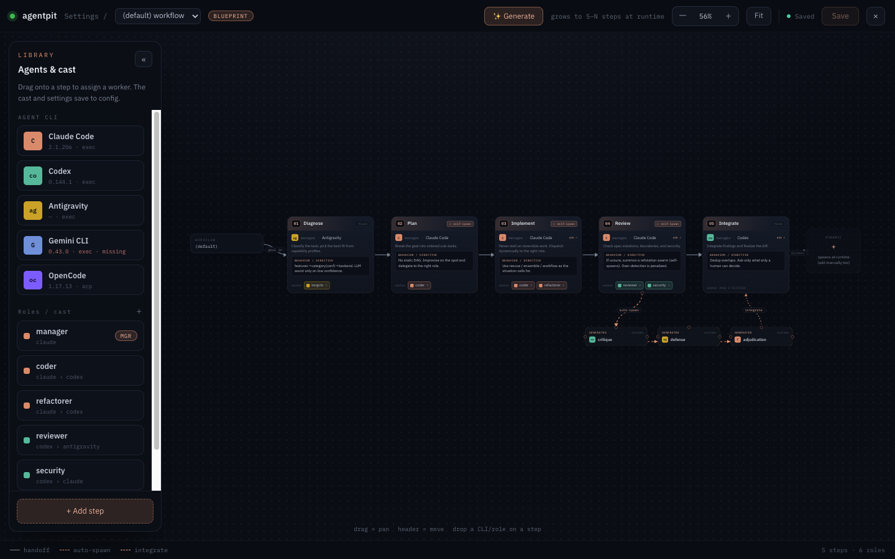
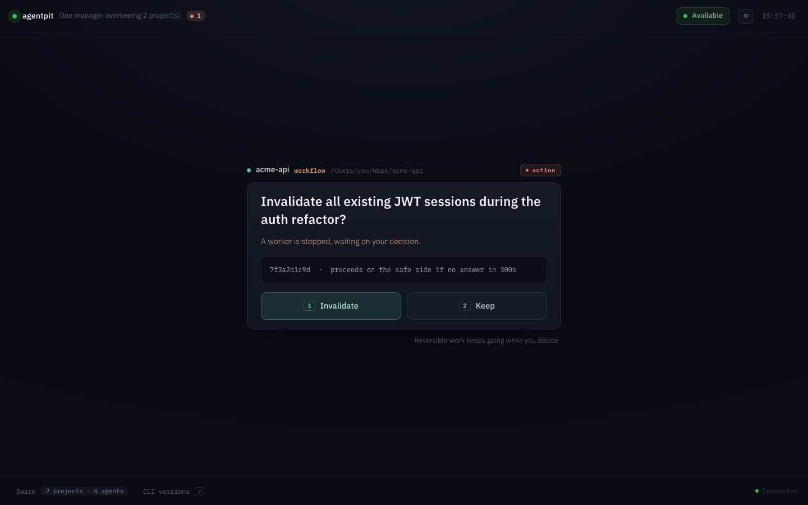
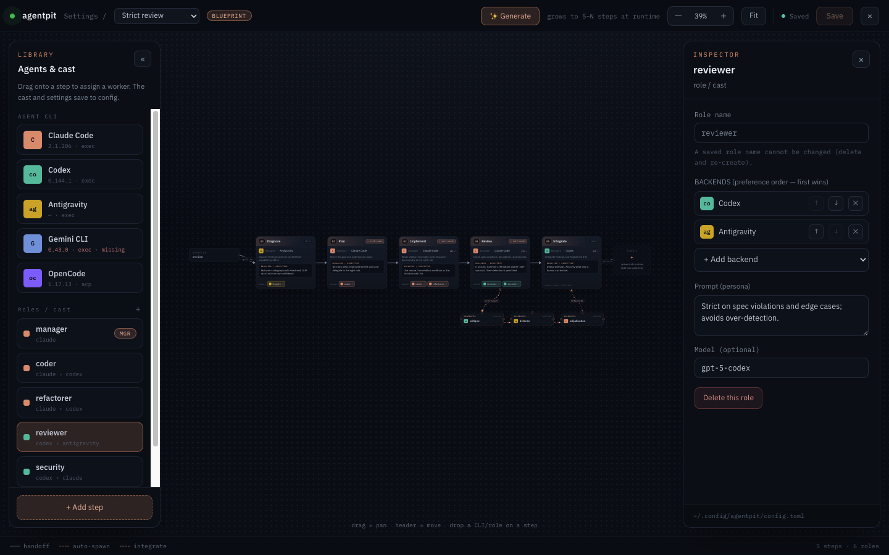

# agentpit

Single-binary CLI that routes coding tasks across **Antigravity (agy)**, **Claude Code**, **Codex**, and **OpenCode** — pick the best agent per task, fan out to several in parallel, or let `agentpit` choose for you.



<p align="center"><em>The desktop dashboard's <strong>Workflow Studio</strong>: cast each agent CLI into a role, design a model-driven workflow, and pin a model per agent.</em></p>

## Why

Different coding agents are good at different things: long-context reads on Antigravity, refactors on Claude, adversarial review on Codex, free local models on OpenCode. `agentpit` is the dispatcher in front of them so you never have to remember which CLI to open.

- **One binary, many backends** — Rust, no runtime
- **One-shot dispatch** — `agentpit rescue "task"` picks a backend by your routing rules
- **Ensembles** — `agentpit review <target>` runs Codex + OpenCode in parallel (configurable) and optionally synthesizes
- **Model-driven workflows** — a manager backend decomposes a goal and dispatches sub-tasks to configured **roles** (the cast), then synthesizes
- **Named workflows** — `agentpit workflow <type> "goal"` runs a saved preset; `workflow list` shows what's configured; `workflow new "<description>"` generates one for you
- **Per-agent models** — pin a model per role or backend (`--model`, `[workflow.roles.<name>].model`, `[backends.<id>].model`), flowing through both one-shot and workflows
- **Desktop-first app** — the decision cockpit, complete CLI settings, updates, and **Workflow Studio** in one install; the matching CLI ships inside it
- **Auth-aware** — checks each backend's credentials before dispatching; `agentpit login <backend>` triggers the right login flow
- **Self-updating** — the desktop app checks and installs paired app + CLI releases automatically; standalone CLI installs keep `agentpit update`
- **Discoverable** — running `agentpit` with no args opens an interactive menu

## Install

### Desktop app from GitHub Releases (recommended)

Download the installer for your platform from the latest GitHub Release (`.dmg` on macOS,
`.AppImage` / `.deb` on Linux). The desktop app is the primary distribution and already contains
the matching `agentpit` CLI sidecar used for workflows, settings, and updates. Automatic updates
are enabled by default and can be changed under **Settings → App & updates**.

### Standalone CLI (optional)

Use this only when you want `agentpit` directly on `PATH` without installing the desktop app:

```bash
# macOS arm64 example — adjust target for your platform
curl -L https://github.com/ymadd/agentpit/releases/latest/download/agentpit-aarch64-apple-darwin.gz \
  | gunzip > agentpit
chmod +x agentpit
mv agentpit ~/.local/bin/
agentpit --version
```

Targets published: `aarch64-apple-darwin`, `x86_64-apple-darwin`, `x86_64-unknown-linux-gnu`.

The release continues to publish `agentpit-dashboard-<target>.gz` for existing portable
installations. New installs should use the desktop bundle, which packages both binaries together.

> Releases ship plain gzipped binaries (not `.tar.gz`) because `self_update`'s tar entry-name matching is fragile across BSD/GNU tar — plain `.gz` lets the library stream decompress straight to the target path. `agentpit update` from v0.1.5 onward works against this format with no changes.

### From source

```bash
cargo install --git https://github.com/ymadd/agentpit
```

### Install Claude Code commands + skills

```bash
agentpit init           # interactive picker: project (./.claude/) or user (~/.claude/)
agentpit init --scope user
```

## Backends

| Backend | CLI on PATH | Default transport | Auth check |
|---|---|---|---|
| `antigravity` (alias `agy`) | `agy` | exec | `~/.gemini/oauth_creds.json` (shared with Gemini CLI) |
| `claude` | `claude` | exec | `~/.claude.json` |
| `codex` | `codex` | exec | `codex login status` |
| `opencode` | `~/.opencode/bin/opencode` | acp | binary present |

Each backend's transport (`exec` per-request or `acp` persistent session) can be overridden in `config.toml`.

Backend output is streamed to the terminal and dashboard without exposing provider-specific
framing. Claude Code (`stream-json` partial messages),
and Codex (`exec --json`) are decoded into clean text plus live tool progress; OpenCode already
streams text through ACP. Antigravity currently has no documented structured stream, so its
`--print` stdout remains a best-effort byte stream. Aggregators receive only the decoded answer —
never JSONL or progress lines.

### Installing the backends

- **Antigravity CLI** — `curl -fsSL https://antigravity.google/cli/install.sh | bash` (Gemini CLI's successor; Go binary)
- **Claude Code** — install per [Anthropic docs](https://docs.claude.com/claude-code)
- **Codex** — `npm i -g @openai/codex`
- **OpenCode** — `curl -fsSL https://opencode.ai/install | bash`

## Usage

```bash
agentpit                              # interactive menu

agentpit rescue "list files in src/" # one-shot
agentpit rescue "..." --backend agy   # force a backend

agentpit review src/lib.rs            # multi-agent review (defaults: antigravity + opencode)
agentpit review src/ --members antigravity,claude,codex --aggregator claude

agentpit security-review src/auth.rs  # OWASP-style review (defaults: claude + codex)
agentpit adversarial-review src/      # hostile, evidence-demanding review (defaults: codex + antigravity)

agentpit explain src/router.rs        # antigravity-first by default
agentpit refactor src/big.rs "split into modules"

agentpit ensemble "design X" --members antigravity,claude,codex

agentpit workflow "fix the auth flow"            # model-driven workflow: a manager orchestrates roles
agentpit workflow review "check the diff"        # run a named [workflow.types.review] preset
agentpit workflow list                           # show the base workflow + every configured type
agentpit workflow new "a strict PR review flow"  # generate a workflow from a description
agentpit rescue "..." --role reviewer --model opus  # dispatch to a role, pinned to a model

agentpit status                       # config + per-backend auth state
agentpit login antigravity            # opens `agy auth login` in a terminal
agentpit dashboard                    # launch a separately installed desktop app
agentpit update                       # update a standalone CLI / portable desktop pair
```

When a workflow manager is not specified by `--manager`, a named workflow, a manager role, or
`[workflow].manager_backend`, agentpit picks the first authenticated supported manager. A
supported `[default].backend` is preferred; otherwise it tries Claude, then Codex. This keeps the
default Antigravity routing useful for one-shot work without selecting it for a manager role it
cannot run.

## Desktop app

The desktop app is the primary agentpit installation and includes the CLI it calls as a bundled
sidecar. A separately installed CLI can still launch a portable desktop binary with
`agentpit dashboard`. The app has three faces:

**The decision cockpit** — one supervised window. A manager backend runs the swarm; the cockpit
surfaces *exactly one* thing that needs a human at a time, and says so when nothing does (inbox
zero). Reversible work never stops while you decide.



**Complete settings** (⚙) — edit the same XDG-aware `config.toml` the CLI reads: defaults,
tool routes, automatic routing signals, backend transport/models, every ensemble, and workflows.

**The Workflow Studio** (Settings → Workflow) — cast each agent CLI into a **role**, design a
model-driven workflow visually, and pin a **model per agent**. Save named workflow *types* (presets
over a shared cast) or hit **✨ 生成** to have an agent draft one from a description — everything
writes back to `~/.config/agentpit/config.toml`.

| Named workflows (types) | Per-agent roles & models |
|---|---|
|  |  |

## Configuration

`agentpit` reads `~/.config/agentpit/config.toml` (XDG-aware). Edit all supported fields in the
desktop Settings screen, run `agentpit config` for the terminal editor, or edit the file directly.

```toml
[default]
backend = "claude"
auto_route = true

# [routes] is optional and empty by default. An entry here is a HARD PIN that wins over
# auto-routing entirely, so the capability-profile and similarity stages never run for that
# tool and `agentpit profile learn` can never influence it. Pin only what you want frozen.
# [routes]
# review = "claude"

[auto_route]
long_context_threshold = 100000
long_context_backend   = "claude"
review_keywords        = ["review", "audit", "critique", "security"]
review_backend         = "claude"

[ensemble]
default_members = ["antigravity", "claude", "opencode"]
# aggregator    = "claude"

review_members  = ["antigravity", "opencode"]
# review_aggregator = "claude"

# Per-tool ensembles (split prompts across multiple backends)
# rescue_members   = ["antigravity", "codex"]
# refactor_members = ["claude", "antigravity"]

# Per-backend transport override
# [backends.antigravity]
# transport = "exec"
```

Environment variables in string values are expanded as `${VAR}`.

### CLI config helpers

```bash
agentpit config show
agentpit config init [--force]
agentpit config backend antigravity          # interactive transport + default-model settings
agentpit config route review --backend agy   # set per-tool default
agentpit config ensemble review              # edit members + aggregator
```

## Antigravity (agy) — Gemini CLI's successor

Google announced Antigravity 2.0 at I/O 2026; **Gemini CLI free / Pro / Ultra tiers stopped serving requests on 2026-06-18** and migrated to `agy`. The `gemini` backend was removed in v0.1.34 — its client now returns `IneligibleTierError` for individual plans. Use `agy` instead; both `--backend antigravity` and `--backend agy` resolve to it.

```bash
# Migrate Gemini CLI plugins into Antigravity (if you used it before)
agy plugin import gemini

# Route long-context work to agy globally
agentpit config route rescue --backend antigravity
agentpit config route explain --backend antigravity
```

Notes:

- Exec spec defaults to `agy --dangerously-skip-permissions --print <task>`. **`--dangerously-skip-permissions` skips per-action approval prompts**, so `agy` can edit / delete files without confirmation. Drop the flag in `src/exec/antigravity.rs` if you want explicit confirmation.
- If `agy`'s non-interactive flag changes, edit the same file.
- ACP transport is **not yet wired** for `agy` — once Google publishes an `--acp` mode equivalent we'll add it.
- Auth is OAuth on first run of `agy`. For headless boxes use `agy auth login`.

## How auto-routing works

When `default.auto_route = true` (the default), `agentpit` resolves a backend in this order
and stops at the first hit:

1. An explicit `--backend` flag
2. A per-tool `[routes]` pin — **empty by default**, and a pin here skips every stage below,
   so a tool you pin never benefits from measured capability
3. Capacity: the prompt's estimated token count exceeds `long_context_threshold` →
   `long_context_backend` (the estimate is roughly `chars / 4`, not a character count).
   Runs before the capability stages because fitting the context is a constraint, not a
   preference — a huge task with a clear category signal must not be captured by a
   confident diagnosis and sent to a backend it doesn't fit
4. Similarity: a backend that won sufficiently similar past tasks (kNN over `routes.jsonl`;
   only in `--features similarity` builds with the embedding model installed)
5. Capability profile: the task is diagnosed into a `TaskCategory`, and when the diagnosis is
   confident enough the highest-scoring available backend for that category wins. Candidates
   within `auto_route.quality_margin` of the best are treated as equal on quality, and the
   cheapest (`[backends.<id>].cost`) takes it
6. Review keyword: the prompt contains one of `review_keywords` → `review_backend`
7. `default.backend`

Steps 3–6 run only when `auto_route` is on and a task text is present, and they all skip a
backend whose last dispatch failed with a quota / tier / auth-shaped error in the past 30
minutes (read from the event log — credentials being present doesn't mean the backend
works, and capability scores deliberately don't encode plan-dependent availability). Steps
1, 2 and 7 are user decisions and always route as written. `agentpit diagnose "<task>"`
prints exactly what this chain would pick — including any currently suspended backends —
and `agentpit status` warns when a `[routes]` pin is suppressing steps 3–6 for a tool.

## Workspace

The CLI, shared event schema, and Tauri desktop app share one Cargo workspace and root
`Cargo.lock`:

```bash
cargo build -p agentpit --release
npm --prefix dashboard/frontend ci
npm --prefix dashboard/frontend test
npm --prefix dashboard/frontend run build
cargo run -p agentpit-dashboard
```

The dashboard is a Vite/React app embedded by Tauri at compile time, so its `dist/` bundle must be
built before `cargo run -p agentpit-dashboard` in a clean checkout.

The workspace's default members remain the CLI and shared crate, so a plain `cargo build`
does not pull the desktop/Tauri dependency graph.

## License

Apache-2.0 — see `Cargo.toml`.
