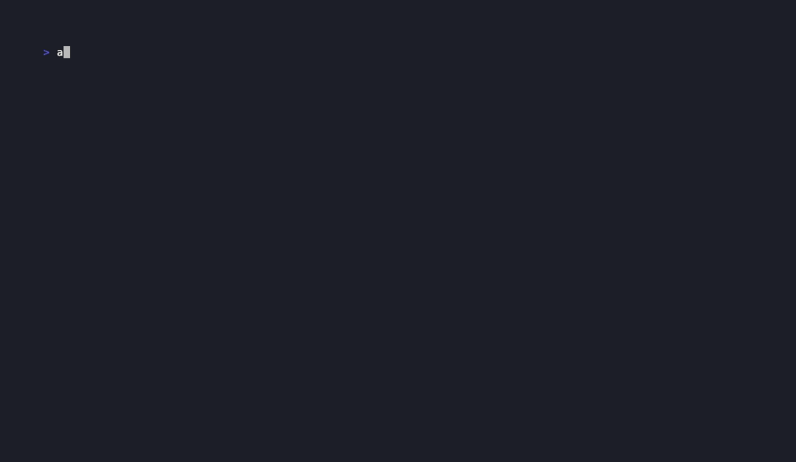

# agentpit dashboard

A native desktop window that shows what `agentpit` is doing **right now** — which runs
are in flight, which backends are still working, and how each one finished.



## How it works

`agentpit` appends one JSON object per event to an append-only log:

```
$XDG_STATE_HOME/agentpit/events.jsonl   (default: ~/.local/state/agentpit/events.jsonl)
```

Every dispatch emits `run_started → member_started → member_finished → run_finished`.
The dashboard ([Tauri](https://tauri.app), WKWebView on macOS) watches that file with
`notify`, rebuilds run state on each change, and pushes a snapshot to the UI.

A run is shown as **LIVE** while it has no `run_finished` event *and* its process is
still alive (checked via `kill(pid, 0)`); if the process dies mid-run it drops to
**Recent** marked `interrupted`, so nothing hangs in the live list forever.

Disable event emission entirely with `AGENTPIT_NO_EVENTS=1`.

## Run it

Once the `agentpit-dashboard` binary is installed next to `agentpit` (or on `PATH`):

```bash
agentpit dashboard
```

`agentpit dashboard` finds the binary via `AGENTPIT_DASHBOARD_BIN`, then next to the
`agentpit` executable, then `PATH` — and spawns it detached.

To build/run it directly during development (the frontend is plain static HTML/CSS/JS —
no build step, no Node — so a bare `cargo run` launches the window, no `tauri-cli`
required):

```bash
cd dashboard/src-tauri
cargo run            # or: cargo build --release && cp target/release/agentpit-dashboard ~/.local/bin/
```

Then, in another terminal (or from Claude Code), drive agentpit and watch it update live:

```bash
agentpit ensemble "design a cache" --members gemini,claude,codex
agentpit review src/
```

## Layout

```
dashboard/
  ui/                 static frontend (index.html, style.css, app.js)
  src-tauri/
    src/main.rs        Tauri app: file watcher + pid liveness + `get_snapshot`
    src/state.rs       JSONL → run/member snapshot (mirrors the event wire format)
    tauri.conf.json    points frontendDist at ../ui; withGlobalTauri for the JS API
```

The dashboard deliberately mirrors the event schema as strings rather than depending on
the `agentpit` crate, so it stays a lightweight, independent consumer of the log.
